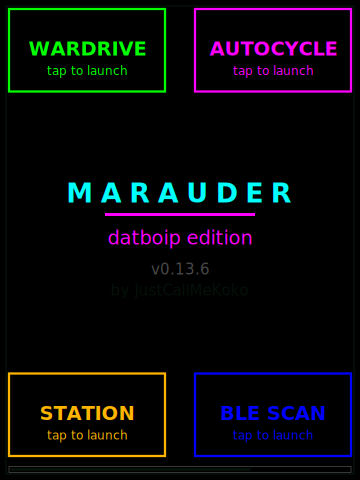

# ESP32 Marauder — datboip edition

<p align="center">
  
</p>

<p align="center">
  <b>Custom wardriving firmware for ESP32 Marauder V6 / V6.1</b>
  <br>
  Built on <a href="https://github.com/justcallmekoko/ESP32Marauder">JustCallMeKoko's ESP32 Marauder</a> v1.11.0
</p>

---

## Downloads

> **Flash the correct version for your board.** Check the front of your PCB — if it says V6.1 or V6.2, use the V6.1 bin. If it says V6, use the V6 bin. Flashing the wrong one will break touch/SD.

| V6.1 | V6 |
|------|-----|
| [marauder-datboip-v6_1.bin](https://github.com/datboip/ESP32Marauder/releases/download/v1.11.0-datboip/marauder-datboip-v6_1.bin) | [marauder-datboip-v6.bin](https://github.com/datboip/ESP32Marauder/releases/download/v1.11.0-datboip/marauder-datboip-v6.bin) |

[All releases](https://github.com/datboip/ESP32Marauder/releases)

## How to Flash

**SD Card (easiest — no computer needed):**
1. Download the `.bin` for your board
2. Rename it to `update.bin`
3. Copy to the root of your SD card
4. On the Marauder: **Device > Update Firmware** > select the file
5. It flashes and reboots automatically

**USB:**
```bash
esptool.py --port /dev/ttyUSB0 --baud 921600 write_flash 0x10000 marauder-datboip-v6_1.bin
```

---

## What's Different from Stock

Everything in stock Marauder, plus:

### Boot Shortcuts
4 corner tap zones on the splash screen. Tap during the 4-second boot window to jump straight into:
- **Wardrive** (top-left)
- **AutoCycle** (top-right)
- **Station Scan** (bottom-left)
- **BLE Scan** (bottom-right)

### AutoCycle
Automatically cycles through scan modes with configurable durations:

Probe Sniff (60s) → Beacon Sniff (45s) → AP Scan (30s) → Deauth Detect (30s) → BLE Scan (45s)

Fullscreen live display with current mode, progress bar, timer, and cycle counter. CLI: `autocycle -s start/stop/status`

### Big Touch Zones
Menu navigation uses 25% / 50% / 25% layout (Up / Select / Down) instead of stock equal thirds. Larger top and bottom targets for easier tapping while driving.

### Extra CLI Commands
`autocycle` · `listfiles [dir]` · `readfile <path>` · `brightness`

---

## Upstream Contributions

These features were developed here and merged into the main ESP32 Marauder project:

- **[PWM Brightness](https://github.com/justcallmekoko/ESP32Marauder/pull/1142)** — 13-level dimming, NVS persisted
- **[Wardrive POI Tagging](https://github.com/justcallmekoko/ESP32Marauder/pull/1166)** — tap to drop GPS waypoints during wardrive
- **[Night Mode / Blackout](https://github.com/justcallmekoko/ESP32Marauder/pull/1165)** — hold-to-blackout with progressive dimming, ultra-low brightness levels *(pending merge)*

---

## Build from Source

```bash
# Uncomment your board in configs.h (line 16 for V6, line 17 for V6.1), then:
arduino-cli compile --fqbn esp32:esp32:d32 \
  --build-property "build.partitions=min_spiffs" \
  --build-property "upload.maximum_size=1966080" \
  esp32_marauder/

arduino-cli upload --fqbn esp32:esp32:d32 --port /dev/ttyUSB0 esp32_marauder/
```

---

## Credits

- [JustCallMeKoko](https://github.com/justcallmekoko) — ESP32 Marauder creator
- [ESP32 Marauder Wiki](https://github.com/justcallmekoko/ESP32Marauder/wiki) — full documentation
- [Buy a Marauder](https://www.justcallmekokollc.com) — support the original project
